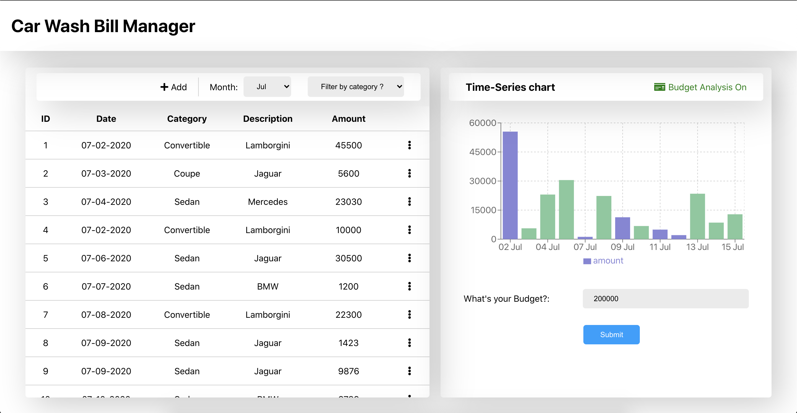
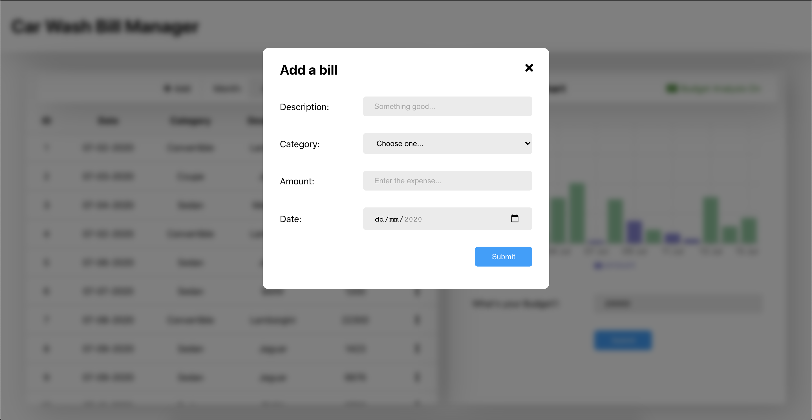
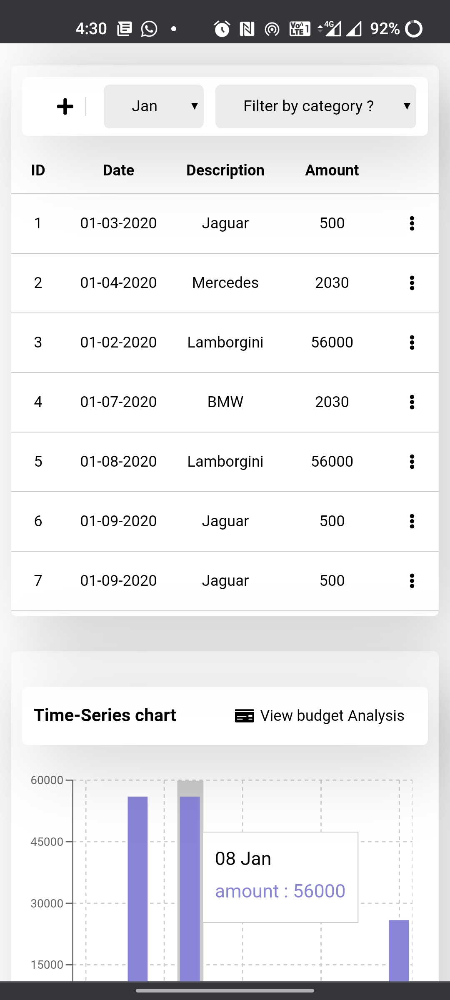
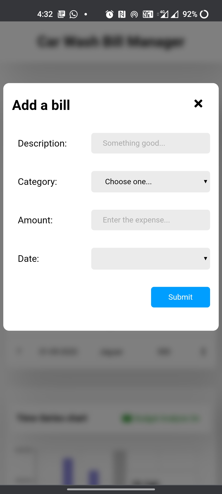

# Car Wash Bills Manager

A sample bill management dashboard built using React & Redux (Scroll further below for more detials...)

<!--  -->

## Features

### Level 1

- The dashboard has Add, Edit, Delete functionality

- The Bills are listed on Monthly basis

- Time-series graphs represent each month's expenditure visually in real time

- All components are created, desinged and animated manually from scratch (No CSS component design library used)

- The app is fully responsive between desktop & mobile devices, with fluid component design & styles

- The entries can be filtered by category

- When handling data, for ease of demo purposes the year has been locked to '2020', with choice to perform all above operations across the months & dates

### Level 2

- The Time series graph has a "View Budget Analysis" feature

- When toggled, it higlights the minimum number of bills that should be paid such that their total value does not exceed the monthly budget value while meeting the condition that no more bills can be added from the remaining bills.

- This feature renders in real time as well

## Technical Specifications

- Built over CRA
- Built using React Hooks
- React Router
- Redux based on session data
- Redux Persist
- Formik
- Styled Components
- ReCharts
- Fontswesome

## Setup Instructions

- After cloning / downloading
- `npm install`
- `npm start`

< > by [Kinshuk Ghildial](http://kinshukghildial.com/) :fire:
